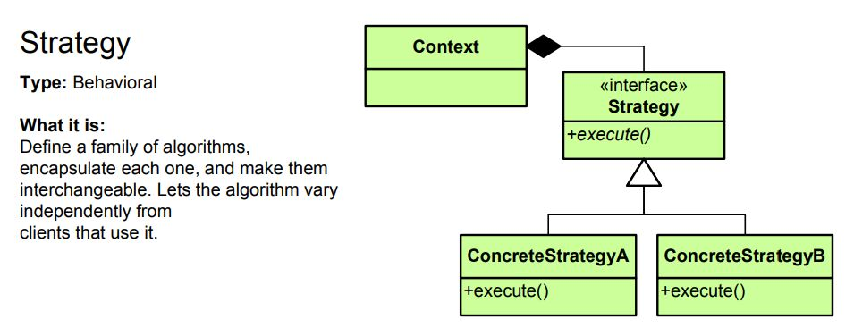

# Java策略模式以及来自lambda的优化
----
# 前言
&emsp;&emsp; 设计模式是软件工程中一些问题的统一解决方案的模型,它的出现是为了解决一些普遍存在的,却不能被语言特性直接解决的问题,随着软件工程的发展,设计模式也会不断的进行更新,本文介绍的是经典设计模式-策略模式以及来自java8的lambda的对它的优化。

# 什么是策略模式
## 定义
> 策略模式定义了算法家族,分别封装起来,让他们之间可以互相替换,此模式让算法的变化,不会影响到使用算法的客户。 (摘自<大话设计模式>)
## 我的理解
&emsp;&emsp;我的理解还是很简单,策略模式定义的是封装算法,其实算法就是行为的一种,所以我的理解是只要是某个地方需要根据不同的情况执行不同的策略,就可以尝试使用策略模式,无需管内部究竟是算法还是什么业务,这样做的好处就是在于可以消除掉条件判断语句,将行为独立出来进行测试修改等等,下面举一个例子再来说明它的优势与优化点。

# 例子
## 传统实现
这里举一个加法,减法,乘法的例子,使用策略模式进行封装
策略算法公共接口,定义了计算的方法
```java
public interface Strategy {

    /**
     * 计算接口
     * @param x
     * @param y
     * @return
     */
    int calclate(int x, int y);
}
```

子类,加法,减法,乘法,作为策略接口的不同实现
加法
```java
public class Add implements Strategy {

    @Override
    public int calclate(int x, int y) {
        return x + y;
    }
}
```

减法
```java
public class Sub implements Strategy {

    @Override
    public int calclate(int x, int y) {
        return x - y;
    }
}
```

乘法
```java
public class Mul implements Strategy {

    @Override
    public int calclate(int x, int y) {
        return x * y;
    }
}
```

上下文环境类,用于客户端与这些算法接口交互,通过getResult()方法对外交互
```java
public class Context {
    private Strategy strategy;

    public Context(Strategy strategy) {
        this.strategy = strategy;
    }

    public int getResult(int x, int y) {
        return strategy.calclate(x, y);
    }
}
```

客户端,根据不同的需求实例化不同的Context类,统一使用getResuslt方法获得结果
```java
public class Client {
    public static void main(String[] args) {
        Context context;
        int x = 10;
        int y = 5;
        String strategy = "add";

        switch (strategy) {
            case "add":
                context = new Context(new Add());
                break;
            case "sub":
                context = new Context(new Sub());
                break;
            default:
                context = new Context(new Mul());
                break;
        }

        System.out.println(context.getResult(x, y));

    }
}
```

输出结果
```
15
```

策略模式将这些加减乘除不同的算法使用侧罗子类进行包裹,客户端根据需求实例化Context类,然后通过Context类的getResult方法实现接口的调用,注意这里与简单工厂模式的区别,简单工厂通过Factory实例化出不同的类,然后调用类的getResult()的方法获得结果,而策略模式是调用Context的getResult方法获得结果,所以简单工厂模式客户端需要与工厂以及实例化的类关联,策略模式客户端只与Context类相关联,可以说耦合度进一步降低了。

## 结合简单工厂模式进行优化
可以看出上文的一部分逻辑判断语句选择放在了客户端中,这是不太好的,而策略模式关联的类只有Context,所以这一部分逻辑完全可以仿照简单工厂模式转移到Context类中。

Context类,将switch判断转移其中
```java
public class Context {
    private Strategy strategy;

    public Context(String strategy) {
        switch (strategy) {
            case "add":
                this.strategy = new Add();
                break;
            case "sub":
                this.strategy = new Sub();
                break;
            default:
                this.strategy = new Mul();
                break;
        }

    }

    public int getResult(int x, int y) {
        return strategy.calclate(x, y);
    }
}
```

客户端类,完全只负责交互,这里只与Context耦合
```java
public class Client {
    public static void main(String[] args) {
        Context context;
        int x = 10;
        int y = 5;

        //add
        context = new Context("add");
        System.out.println(context.getResult(x, y));
        //sub
        context = new Context("sub");
        System.out.println(context.getResult(x, y));
        //mul
        context = new Context("mul");
        System.out.println(context.getResult(x, y));

    }
}
```

## 总结与思考
### 总结
为了方便理解与代码精简,这里只做了一个简单的加减乘的算法封装,目的是为了让大家理解策略模式的封装算法行为,通过Context与客户端,与简单工厂的不同的是,耦合度更低,并且可以通过结合简单工厂模式的特点之一,将判断逻辑转移到Context中,下面是uml图


这个模式涉及到三个角色：
-上下文环境(Context)角色：持有一个Strategy的引用,负责与客户端进行交互
-抽象策略(Strategy)角色：这是一个抽象角色，通常由一个接口或抽象类实现。此角色给出所有的具体策略类所需的接口。在上文中即是Strategy类。
-具体策略(ConcreteStrategy)角色：包装了相关的算法或行为,是策略类的子类,对策略接口的不同实现,在上文的例子中是add,sub,mul类

### 优点
- 解耦,将算法的公共部分抽象出来统一调用,客户端不与算法交互,通过Context来交互
- 算法子类的添加,修改与复用变得十分容易
- 由于每个算法类都单独抽离出来,方便单元测试
- 通过这些算法子类可以消除环境中的判断语句
### 可优化点
- 同命令模式一样,100个算法就要生成100个子类,类的数量过多
- 部分逻辑语句只是转移到了Context种,并没有完全消除,实例化依然避免不了进行判断
### 思考
和上一篇的优化命令模式一样,既然是对算法也就是行为的封装,那么在策略模式中使用lambda封装算法接口一定也是可行的。

## 使用lambda进行优化
经过上一章命令模式的优化经验,策略模式优化起来可谓得心应手,这里考虑到我们需要封装的行为是接受两个相同类型的参数,做加减乘的运算,返回同类型的结果,这里选用的函数接口是`BinaryOperator<T>`,该接口接受两个T类型的参数,返回一个T类型的结果,当然也可以选用更加常见`BiFuntion<T,K,R>`,该接口接受T,K类型的两个参数,返回R类型的结果,三种类型可以一致。

在这里只需将原来用于封装算法的算法接口以及他们的子类直接替换成BinaryOperator接口即可,类的数量减少为两个,代入如下。

使用BinaryOperator接口优化后的Context类
```java
public class Context {
    private BinaryOperator<Integer> strategy;

    public Context(BinaryOperator<Integer> strategy) {
        this.strategy = strategy;

    }

    public int getResult(int x, int y) {
        return strategy.apply(x, y);
    }
}
```

客户端代码
```java
public class Client {
    public static void main(String[] args) {
        Context context;
        int x = 10;
        int y = 5;

        //add
        context = new Context((integer, integer2) -> integer + integer2);
        System.out.println(context.getResult(x, y));
        //sub
        context = new Context((integer, integer2) -> integer - integer2);
        System.out.println(context.getResult(x, y));
        //mul
        context = new Context((integer, integer2) -> integer * integer2);
        System.out.println(context.getResult(x, y));

    }
}
```

- 在保持优点的情况下,类的数量由6个减少到了2个,可谓是极度的精简了
- 可观察发现,客户端这里似乎还需要手动的编写lambda代码算法,感觉似乎这样的写法达不到复用的效果,当然可以像上文在context中定义swich判断,然后进行不同的lambda表达式的传入,可有没有更好的效果呢？当然有,比较敏感的同学在观看前面代码的时候应该就有感觉,传统的实现传入的是常量,而常量在实际中使用枚举效果往往更好,因此在这里,我们也使用枚举类集合lambda表达,再一步优化

## 使用枚举类结合lambda进一步的优化
封装lambda算法的StrategyEnum枚举,对外提供get方法获得内部的封装的算法
```java
public enum StrategyEnum {
    ADD((x, y) -> x + y),
    SUB((x, y) -> x - y),
    MUL((x, y) -> x * y);
    
    private BinaryOperator<Integer> operator;

    StrategyEnum(BinaryOperator<Integer> operator) {
        this.operator = operator;
    }

    public BinaryOperator<Integer> get() {
        return operator;
    }
}
```

Context类内拥有Enum成员变量,通过调用get方法获得函数对象再调用apply对参数进行操作
```java
public class Context {
    private StrategyEnum strategy;

    public Context(StrategyEnum strategy) {
        this.strategy = strategy;

    }

    public int getResult(int x, int y) {
        return strategy.get().apply(x, y);
    }
}
```

客户端代码,为了方便显示静态导入枚举类
```java
public class Client {
    public static void main(String[] args) {
        int x = 10;
        int y = 5;

        //add
        System.out.println(new Context(ADD).getResult(x, y));
        //sub
        System.out.println(new Context(SUB).getResult(x, y));
        //mul
        System.out.println(new Context(MUL).getResult(x, y));
    }
}
```

运行结果
```
15
5
50

Process finished with exit code 0
```

运行良好,可以看到使用枚举类封装lambda算法对外提供算法的效果是惊人的,虽然和之前的lambda直接优化相比多了一个类,但是无论从代码的精简程度还是风格以及可读性上,都强上了一个档次,最后版本的策略模式的代码量几乎已经不能再少了,十分简洁,同时保留了策略模式的所有特性,包括算法的复用,测试,与客户端的解耦,对上文提到的几个优化点都完成了优化。

# 结尾
上文的例子为了方便理解举的例子十分简单,但是包含的思想确是一致的,在实际运用中,你所需要的封装内容不一定是算法,可以是业务逻辑,可以是一段处理过程,只要观察代码中是否出现的大量的swich或者if用来判断从而选择结构相同但是内容不同的一段代码时,就该考虑使用上面讲述的 策略模式+lambda+枚举的方式,相信代码的质量可以提高不少。

# 关于本文代码
本文的代码与md文章同步更新在github中的[strategy-mode](https://github.com/xhyrzldf/design-patterns/blob/master/strategy-mode/strategy-mode.md)模块下

